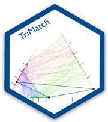
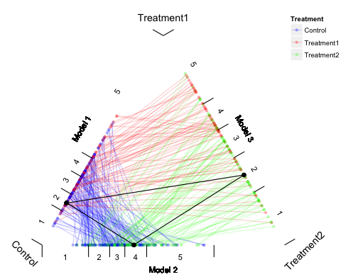

## <a href='https://github.com/jbryer/TriMatch'></a> TriMatch - Propensity score matching for non-binary treatments.

<!-- badges: start -->
`r badger::badge_cran_release("TriMatch", "orange")`
`r badger::badge_devel("jbryer/TriMatch", "blue")`
`r badger::badge_github_actions("jbryer/TriMatch", action = "R-CMD-check")`

<!-- badges: end -->


```{r, include = FALSE}
knitr::opts_chunk$set(
  collapse = TRUE,
  comment = "#>",
  fig.path = "man/figures/README-",
  out.width = "100%"
)
```

### Abstract

The use of propensity score methods (Rosenbaum and Rubin, 1983) have become popular for estimating causal inferences in observational studies in medical research (Austin, 2008) and in the social sciences (Thoemmes and Kim, 2011). In most cases however, the use of propensity score methods have been confined to a single treatment. Several researchers have suggested using propensity score methods with multiple control groups, or to simply perform two separate analyses, one between treatment one and the control and another between treatment two and control. This talk introduces the `TriMatch` package for R that provides a method for determining matched triplets. Examples from educational and medical contexts will be discussed.

Consider two treatments, T r1 and T r2, and a control, C. We estimate propensity scores with three separate logistic regression models where model one predicts T r1 with C, model two predicts T r2 with C, and model three predicts T r1 with T r2. The triangle plot in Figure 1 represents the fitted values (i.e. propensity scores) from the three models on each edge. Since each unit has a propensity score in two models, their scores are connected. The `TriMatch` algorithm will find matched triplets where the sum of the distances within each model is minimized. In Figure 1, the black lines illustrate one matched triplet.

Propensity score analysis of two groups typically use dependent sample t-tests. The analogue for matched triplets include
Figure 1: Triangle Plot repeated measures ANOVA and the Freidman Rank Sum Test. The `TriMatch` package provides utility functions for conducting and visualizing these statistical tests. Moreover, a set of functions extending PSAgraphics (Helmreich and Pruzek, 2009) for matched triplets to check covariate balance are provided.

```{r, echo=FALSE, out.width='80%', fig.align='center'}

```

### References

Austin, P. (2008). A critical appraisal of propensity-score matching in the medical literature between 1996 and 2003. *Statistics in Medicine 27*, 2037–2049.

Helmreich, J. E. and R. M. Pruzek (2009, 2). Psagraphics: An r package to support propensity score analysis. *Journal of Statistical Software 29*(6), 1–23.

Rosenbaum, P. R. and D. B. Rubin (1983). The central role of the propensity score in observational studies for causal effects. *Biometrika 70*, 41–55.

Thoemmes, F. J. and E. S. Kim (2011). A systematic review of propensity score methods in the social sciences. *Multivariate Behavioral Research 46*, 90–118.


### Keywords

propensity score analysis, matching, non-binary treatments

### Installation

```{r, eval=FALSE}
# Install from CRAN
install.packages('TriMatch')

# Or install the package from Github
remotes::install_github('TriMatch', 'jbryer')
```

See `vignette('TriMatch')` for more details. See the [Applied Propensity Score Analysis with R](https://psa.bryer.org) book and R package for a general introduction to propensity score methods.


